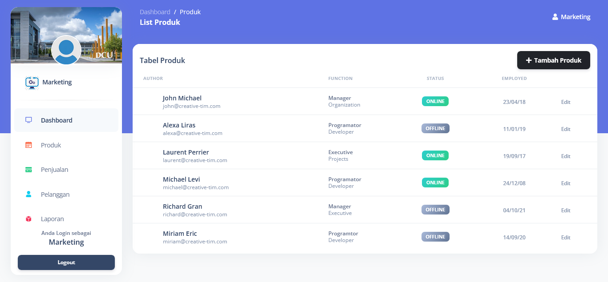

# Sistem
project Sistem Teknisi Komputer

## Sistem Teknisi Komputer

### Features Role User

### Installation
1. Clone the repository using the command "git clone [link]"
2. Create database in MySql
3. Configure the .env file accordingly
4. Run command 

```
$composer install
$php artisan migrate
$php artisan db:seed
$php artisan serve
$php artisan storage:link
```
### Mendapat Update kodingan terbaru
```
$ git fetch origin master
$ git pull origin master
```
### Kirim perubahan coding di local
```
$ git add .
$ git commit -m "catatan perubahan"
$ git push -u origin master
```

### Built With
* Bootstrap- CSS framework
* JQuery- Javascript framework
* Laravel - PHP framework
* MySql- Databse

### Progress fitur 26/7/2023

## login 5 role
* HRD (done)
* Teknisi (done)
* Marketing (done)
* Admin (done)
* User/Pelanggan (done)

## halaman depan

* demo


## Planing Hasil Diskusi
* Master Servis
* Master Produk
* Blog
* Daftar with Code Promo (Pelanggan Baru)
* Pelanggan baru dapat diskon
* Pelanggan lama dapat point setelah servis lebih dari 1 kali
* Booking servis


## progres 28/7/23
* memperbaiki route dashboard berdasarkan role login
* halaman produk marketing

* demo
